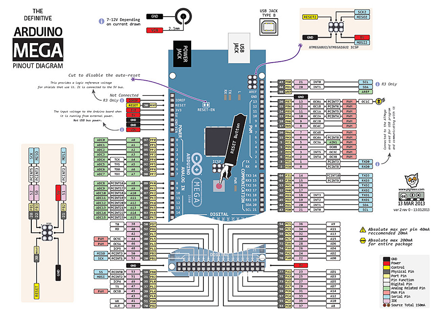

# Asynchronous Stepper Motor Position Control
Controlling __4__ __stepper__ __motors__ with **1 Arduino Mega** by using **16 bit timers**

**1. Hardware**
- **Arduino Mega - ATmega2560 MCU based on AVR Architecture**
- Enable to control 4 Stepper Motors, Syringe pumps asynchronously
- Enable to control 6 Stepper Motors, Syringe pumps synchronously
- Stepper motor position is set based on optical homing sensor and PWM signal on STEP pin of motor driver IC during moving
- __DRV8711__ - Texas Instruments Motor Driver IC Module (**Polulu**)
- Support microstepping
- Support for 6 hardware, X and Y (Motor A and B HBOT), Z1, Z2, Syringe Pump, and more 

- Mega Pin Map - Pin is matched with Arduino Mega pin map 

_STEP = A0;

_DIR = A1;

_SS = 31;

_SLEEP = 39;

_STLFLT = 22;

_HOME = A8;

_RESET = 48;

**2. Important Notice**
- Assigned pin number of Arduino Mega is based on my configuration. User can change the pin assignment.
- _STEP, _DIR, _SS, _SLEEP, _STLFLT, _HOME, and _RESET are should be assigned.

**3. Class Declaration**
    
    ASMC(int MotorNumber, float MotorCurrent, unsigned int max_speed, unsigned int min_speed, unsigned int home_speed, int microstepping, float lead,
                int sample_time_BEMF = 7, int stall_detection_count = 3, int stall_detection_threshold = 0, bool newboard=false);
 

- **Motor Current** should be checked by motor specification
- Based on **MotorNumber**, pre-assigned pins are chosen. Please refer to the ASMC.cpp
- Based on **max_speed** and **min_speed**, the library automatically calculates middle speed.
- **microstepping** is calculated as 2^microstepping. If you want to choose 8 microstepping, you can put 3.
- **lead** is the unit number for changing revolution to linear acutation.

**4. SPI Communication**

- Through SPI communication, Arduino Mega can set motor driver, DRV8711. The SPI communication is based on pre-set pins of Arduino Mega.
You can refer to the Arduino Website for SPI communication.
- Register_DRV8711.h file shows what you can program
- Important Notice: To avoid unexpected current flow at the beginning, when you write register in DRV8711, you should write 0 ENABLE register in CTRL area first.
After finishing all set-up of register in DRV8711, you can write 1 on ENABLE register.
By using this methodology, you can protect your circuit board and motor from unexpected current draw from power source.
Please refer to SPI_DRV8711.cpp.

**5. Stall/Fault Detection**

- There are three main parameters of Stall and Falut detection.
1) Sampling Time of Back EMF - 0: 50us, 1: 100us, 2: 200us, 3: 300us, 4: 400us, 5: 600us, 6: 800us, 7: 1000us
2) Stall Detection Count by Inside Counter in DRV8711 (Please look at the page 23 in '/source/drv8711.pdf'.) - 0: Count 1, 1: Count 2, 2: Count 4, 3: Count 8 
3) Stall Detection Threshold - 0 to 255 -> higher value, more sensitive to stall

